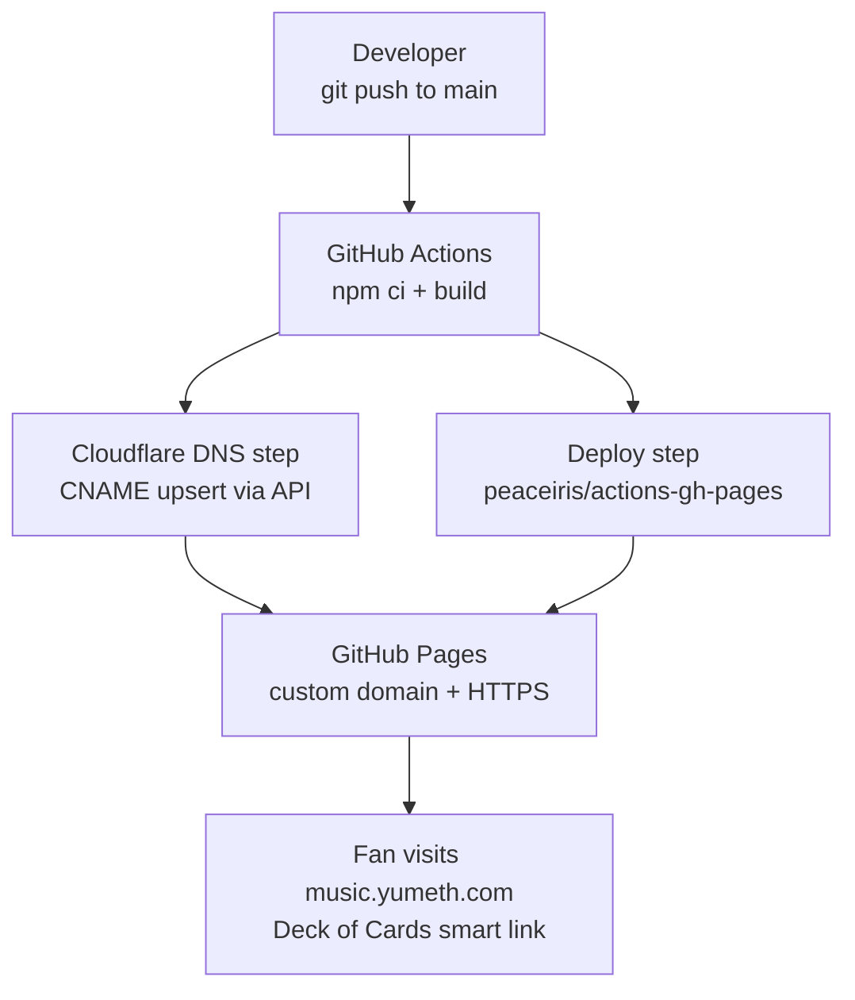
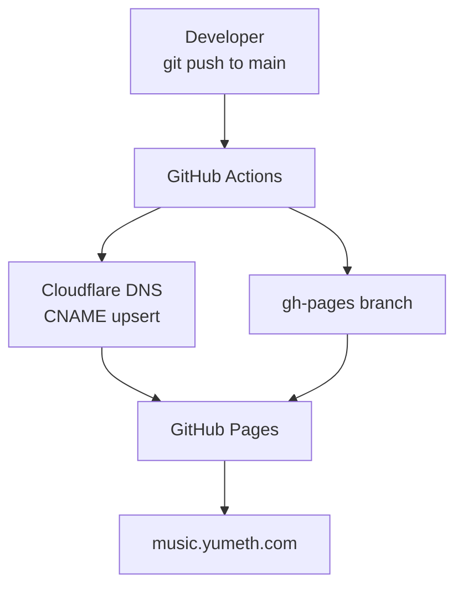

Prompt 1 — GitHub Pages + Cloudflare

I'm building a smart link release page for Yumeth Athukorala's single "Deck of Cards" 
(pilot content for the Azure Indie Artist Platform build-in-public series).

For this first version I want a fully static site hosted on GitHub Pages with a custom 
subdomain managed through Cloudflare DNS, with everything automated via GitHub Actions.

**Custom domain target:** music.yumeth.com (or similar subdomain on my Cloudflare domain)

**Tech stack:**
- Static site: React + TypeScript, built with Vite
- Hosting: GitHub Pages (gh-pages branch)
- DNS: Cloudflare (automated via Cloudflare API in GitHub Actions)
- CI/CD: GitHub Actions

**Release data to hardcode for now (no backend yet):**
Artist: Yumeth Athukorala
Release: Deck of Cards (single)
Cover art: https://imagestore.ffm.to/link/696ebf792e00006b008c5d89/697708312f000016007f72e7_0594eda9b61e8dacb87e1abc2f35d32d.jpeg
Streaming links:
  - Spotify: https://open.spotify.com/album/7tAImO0jC2X682dNB4a4YI
  - Apple Music: https://geo.music.apple.com/us/album/deck-of-cards-single/1866379749?app=music
  - TIDAL: http://www.tidal.com/album/486860762
  - Deezer: https://www.deezer.com/album/890410182
  - Amazon Music: https://music.amazon.com/albums/B0GDXLTZPF
  - YouTube: https://www.youtube.com/watch?v=1KGntXXwfBA
  - YouTube Music: https://music.youtube.com/playlist?list=OLAK5uy_nn8bF0caPTCvoS0r8_mCcXV9dHpW00I6I
Social links:
  - YouTube: https://youtube.com/@yumeth.voicetales
  - Spotify: https://open.spotify.com/artist/48fSdVyiuRXmjGSOCy8aVD
  - TikTok: https://www.tiktok.com/@yumeth.voicetales/
  - Facebook: https://www.facebook.com/yumeth.voicetales/
  - Instagram: https://www.instagram.com/yumeth.voicetales

**What I need built:**

1. React + TypeScript + Vite project structure
   - SmartLinkPage component rendering cover art, platform buttons, social icons
   - Mobile-first responsive design, dark aesthetic (playing card theme)
   - vite.config.ts configured for GitHub Pages base path

2. GitHub Actions workflow: .github/workflows/deploy.yml
   - Trigger: push to main
   - Steps:
     a. Install & build (npm ci && npm run build)
     b. Cloudflare DNS automation:
        - Use Cloudflare API (via CLOUDFLARE_API_TOKEN + CLOUDFLARE_ZONE_ID secrets)
        - Check if CNAME record for the subdomain exists
        - Create or update it to point to <github-username>.github.io
        - Set proxy status to DNS-only (orange cloud OFF) so GitHub Pages TLS works
     c. Deploy dist/ to gh-pages branch using peaceiris/actions-gh-pages
     d. Set GitHub Pages custom domain by writing CNAME file into dist/

3. Required GitHub Actions secrets list:
   - CLOUDFLARE_API_TOKEN
   - CLOUDFLARE_ZONE_ID
   - GH_TOKEN (for pages deployment)

4. GitHub Pages settings config:
   - Enforce HTTPS: true
   - Source: gh-pages branch

Make the Cloudflare DNS step idempotent — safe to run on every push without 
creating duplicate records. Use the Cloudflare API directly via curl in the 
workflow (no third-party Cloudflare actions).

5. Diagram automation — add an update-docs job to deploy.yml (runs after the build job):

   Job name: update-docs
   Needs: [deploy]
   Permissions: contents: write

   Steps:
     a. Generate docs/diagrams/architecture.md
        Create/overwrite with this content:

        # Architecture — GitHub Pages + Cloudflare

        ## Deployment pipeline

        ## DNS flow

     b. Update README.md
        - Check if README.md contains the marker <!-- ARCHITECTURE -->
        - If NOT present, append this block to the end of README.md:

        ## Architecture

        <!-- ARCHITECTURE -->
        See full diagram: [docs/diagrams/architecture.md](docs/diagrams/architecture.md)

        <!-- /ARCHITECTURE -->

        - If marker IS present, replace everything between
          <!-- ARCHITECTURE --> and <!-- /ARCHITECTURE --> with the
          updated mermaid block (idempotent on every push)

     c. Commit and push
        - git config user.name "github-actions[bot]"
        - git config user.email "github-actions[bot]@users.noreply.github.com"
        - Stage: docs/diagrams/architecture.md and README.md
        - Commit message: "docs: update architecture diagrams [skip ci]"
          ([skip ci] prevents infinite loop)
        - Push using GH_TOKEN secret
        - Skip the commit entirely if git diff --staged is empty

Updated Prompt Context: 

1) Can you separate the architecture page creation to a different pipeline rather than having the same in there.
2) yumethathukorala.com is the real domain name | can you use the built-in GITHUB_TOKEN instead of using the secrets?
3) fix: /usr/bin/git push origin --force gh-pages remote: Permission to venura9/deck-of-cards-gh-pages.git denied to github-actions[bot]. fatal: unable to access 'https://github.com/venura9/deck-of-cards-gh-pages.git/': The requested URL returned error: 403 Error: Action failed with "The process '/usr/bin/git' failed with exit code 128"

