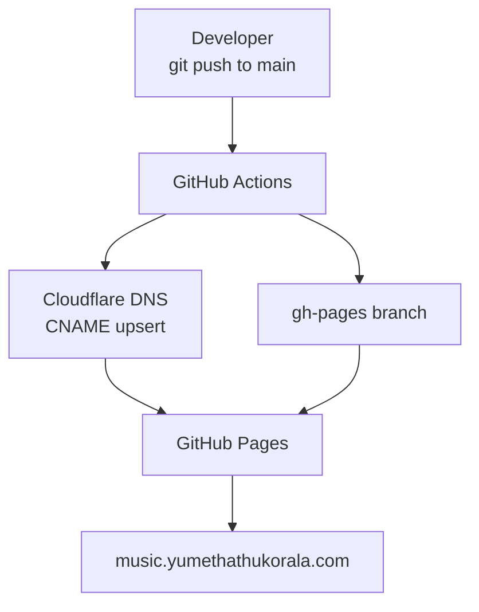

# deck-of-cards-gh-pages

Smart link release page for **Yumeth Athukorala – "Deck of Cards"** (single).

Built with React + TypeScript + Vite, hosted on GitHub Pages at [music.yumethathukorala.com](https://music.yumethathukorala.com), with DNS managed via Cloudflare.

## Architecture

<!-- ARCHITECTURE -->
See full diagram: [docs/diagrams/architecture.md](docs/diagrams/architecture.md)

<!-- /ARCHITECTURE -->

## Required GitHub Actions secrets

| Secret | Purpose |
|---|---|
| `CLOUDFLARE_API_TOKEN` | Cloudflare API token with DNS edit permission |
| `CLOUDFLARE_ZONE_ID` | Cloudflare Zone ID for your domain |

## GitHub Pages settings

- **Source:** `gh-pages` branch
- **Custom domain:** `music.yumethathukorala.com`
- **Enforce HTTPS:** ✅
