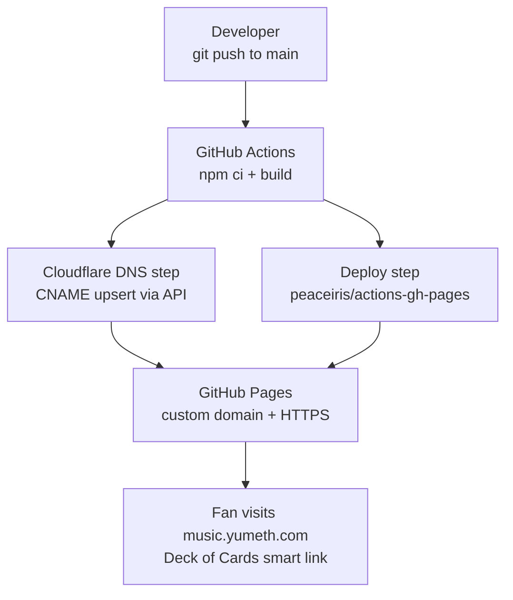

# Architecture — GitHub Pages + Cloudflare

## Deployment pipeline

```mermaid
flowchart TD
    A[Developer<br/>git push to main] --> B[GitHub Actions<br/>npm ci + build]
    B --> C[Cloudflare DNS step<br/>CNAME upsert via API]
    B --> D[Deploy step<br/>peaceiris/actions-gh-pages]
    C --> E[GitHub Pages<br/>custom domain + HTTPS]
    D --> E
    E --> F[Fan visits music.yumeth.com<br/>Deck of Cards smart link]
```

## DNS flow

```mermaid
flowchart LR
    A[music.yumeth.com] -->|CNAME DNS-only| B[venura9.github.io]
    B -->|serves| C[React SPA<br/>gh-pages branch]
```
